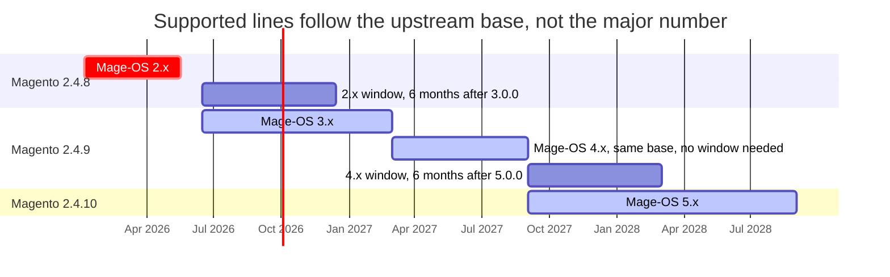
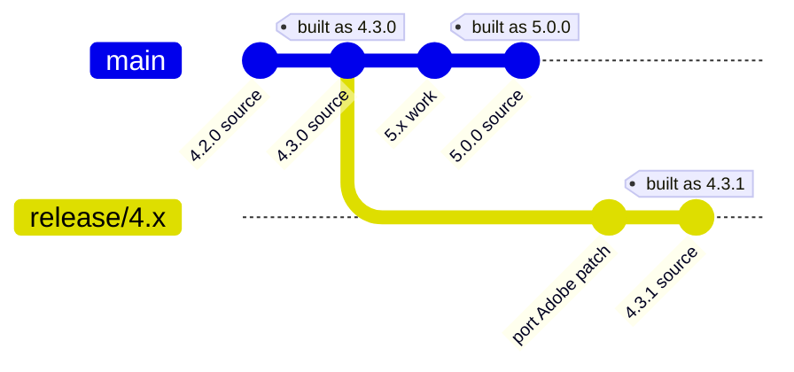

# Proposal: a security maintenance window for the previous upstream base

**Status:** draft for discussion
**Date:** 2026-09-24

## Problem

A Mage-OS line stops the moment the next one ships, so a merchant who is not
ready to move gets nothing — not even a security fix.

Tracing `extra.magento_version` across `resource/history/mage-os/`:

| Mage-OS | Upstream base | Released |
| --- | --- | --- |
| 2.2.2 | 2.4.8-p4 | 2026-05-12 |
| **2.3.0** | **2.4.8-p5** | **2026-05-17 — last 2.x ever** |
| 3.0.0 | 2.4.9 | 2026-06-15 |
| 3.4.0 | 2.4.9 | 2026-08-11 |

Magento 2.4.9 reached GA on 2026-05-12 and Mage-OS 3.0.0 followed 34 days
later. The 2.x line has had **zero** releases since, although Adobe supports its
2.4.8 base until **2028-05-31** and has shipped isolated patches for it in July,
August and September 2026. The fixes exist upstream; we stopped forwarding them.

The same behaviour is encoded in `mage-os/github-actions` at
`supported-version/src/versions/mage-os/individual.json`, where each version's
`eol` is the *next version's release date*.

## Proposal

> **Supported lines:** the current major, plus the last major built on the
> previous Magento feature version, for six months after the first release on
> the new one.

The window follows the **upstream base**, not the major number. A major that
keeps the same Magento version is a safe upgrade, so it needs no window; a major
that moves to a new Magento feature version is what merchants need time for.



Dates after 3.4.0 are illustrative. Two things are load-bearing: only the line
before a base change gets a window, and at most two lines are ever live.

### Scope

- **Security fixes only.** Tiny, low-risk regression fixes at the maintainers'
  discretion. Anything else means upgrading to the current major.
- **Patch versions only** on a maintenance line — `4.3.1`, `4.3.2`. A new minor
  would signal features.
- **The last minor of the line only.** A merchant on `4.1.0` moves to `4.3.x` to
  receive fixes, which is a minor bump on the same Magento base.
- **Event-driven.** We build the maintenance line only when Adobe ships a patch
  for its base.
- **Every supported line ships the same day**, from one patch port, with one
  announcement. If a port needs conflict resolution, the current line is
  published on time and the maintenance build states its ETA. See below.

### What merchants do

| Situation | Action |
| --- | --- |
| On the current major | Upgrade as usual |
| On a major sharing the current Magento version (3.x when 4.x is out) | Upgrade; the base does not change |
| Not ready for the new Magento version | Stay on the last minor of the previous base for six months |
| Window closed | Still installable from repo.mage-os.org; no new fixes |

## Shipping together

The risk of a maintenance line is a split cadence: the current release goes out
with a security fix and the older one follows days later, or holds it up.

The tooling already avoids that. `bin/apply-security-patch.js` (#356) takes
`--branches=main,release/4.x` and ports one Adobe patch to every line in a
single run, so the maintenance port happens alongside the current one, not after
it. Security-only scope keeps each port small; Adobe patches every supported line
on one day, and so should we.

The escape hatch matters as much as the rule: a conflicted hunk on the old line
must never delay a security release on the current one.

## Mechanics

`main` will have moved on, so the maintenance line cannot be built from it, nor
from a tracking branch — `2.3.0...2.4-develop` in `mageos-magento2` is
**diverged, 10,272 commits ahead**. It branches from the commit its last release
was built from.



1. **At 5.0.0 GA, point `release/4.x` at the commit 4.3.0 was built from** — the
   parent of the CI "Release 4.3.0" commit the tag sits on, which only rewrites
   versions. Branch lazily: only repositories that receive a patch need one.
2. **Port Adobe's isolated patch onto it** with `bin/apply-security-patch.js`,
   which rewrites `vendor/` paths to source-tree paths (#356).
3. **Build with a release refs file.** A release tags every repository, so `*`
   points at the outgoing line's last tag and only patched repositories name a
   branch:

   ```js
   // src/build-config/mage-os-release-refs/4.3.1.js
   module.exports = {'*': '4.3.0', 'magento2': 'release/4.x'};
   ```

## Required changes

### 1. `mage-os/generate-mirror-repo-js` (this repo) — in this PR

- [x] `src/make/mageos-release.js`, `src/release-build-tools.js` — a new release
      now honours each repository's and metapackage's `fromTag`, which until now
      only the history rebuild checked. Without it, a release on an older line
      picks up what starts later: a 2.x release would get `magento-zf-captcha`,
      `magento-zf-soap` and the minimal edition, all from 3.0.0. Current-line
      releases are unaffected.
- [x] `.github/workflows/build-mageos-release.yml` — optional
      `release_refs_file` input.
- [x] `.github/workflows/deploy.yml` — threads it through as
      `--releaseRefsFile`, empty by default.
- [x] `src/build-config/mage-os-release-refs/README.md` — documents the
      convention. No version file is included; adding one would change how that
      version builds.

`--releaseRefsFile` parsing (#353) and per-repository refs keys (#354) were
already fixed on `main`. No change is needed in `push-release-tag.yml`: it
pushes tag objects from the build's working copies, so a tag created on
`release/N.x` already points at the right commit.

The **minimal edition** is built by the same release, as the
`product-minimal-edition` and `project-minimal-edition` metapackages, so it
follows the window automatically.

### 2. `mage-os/github-actions` — data, not code

- [ ] `supported-version/src/versions/mage-os/individual.json` — the last
      release of a maintenance line gets `eol` = the first release on the new
      base **plus six months**, and each maintenance release gets its own entry
      with the same `eol`. Earlier entries keep the current behaviour, since
      only the last minor of a line is supported.
- [ ] Add the minimal edition, which has no entries today.

`getCurrentlySupportedVersions` already filters on `release`/`eol`, so only the
dates change.

### 3. The `mageos-*` repositories — no code changes

- [ ] Branch `release/N.x` lazily, only where a patch lands.
- [ ] In `mageos-magento2`, `release/3.x` is the stale 3.0 staging branch: last
      commit 2026-05-18, 59 commits behind 3.4.0, nothing of its own. Whichever
      branch name a maintenance line uses must be reset at that point.

### 4. Release skills — follow-up

- `prep-release-prs` merges `release/N.x` **into** the default branch and
  defaults to that name. It must skip a branch whose line is in its window.
- `analyze-release-preview` compares the previous tag to `main`; for a
  maintenance release it must compare against that line's branch.
- `audit-release-branches` should tell a staging branch from a live maintenance
  branch.

`add-release-history` and `merge-upstream-tracking` need no change.

## Open questions

1. **Does 4.0 contain breaking changes of our own that warrant a one-off 3.x
   window?** Under this rule 3.x gets none, because it shares Magento 2.4.9 with
   4.x. That is correct only if the 3→4 upgrade really is easy; a dropped PHP
   version or removed modules would leave people stuck.
2. **Six months** — long enough to plan a Magento feature upgrade?
3. **Who owns the maintenance line?** Ubuntu and Debian both fund or delegate
   the tail; the same-day rule above only holds if one team ships both lines.

## Effort

- **One-time:** about a week — the refs-file wiring is small, the branch and tag
  plumbing is the real work.
- **Recurring:** one extra build per Adobe patch, two or three per window, done
  in the same session as the current line's release.

---

*Sources: `resource/history/mage-os/` and `resource/history/magento/` in this
repository; branch and tag state on `mage-os/mageos-magento2`,
`mage-os/mirror-magento2` and `mage-os/github-actions`; Adobe Commerce lifecycle
policy. Checked 2026-09-24.*
