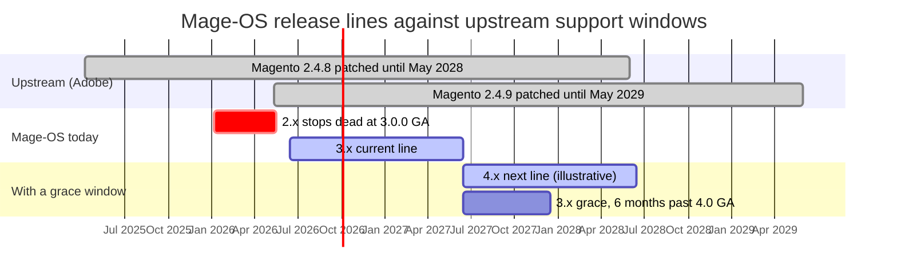
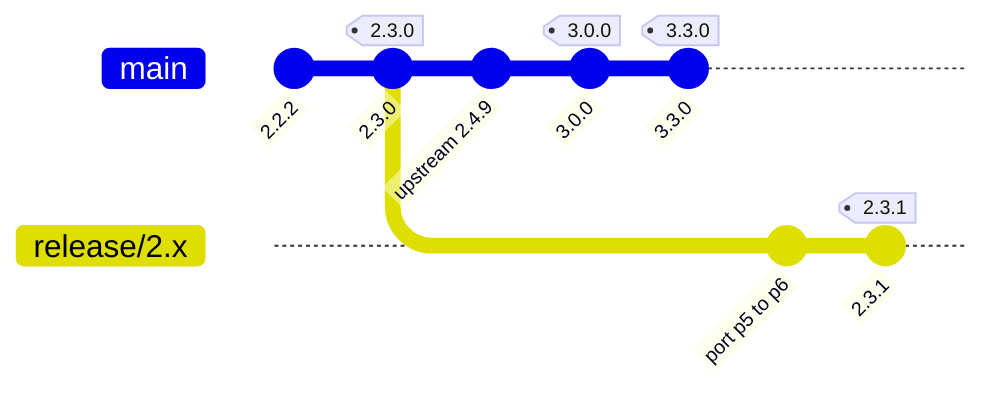

# Proposal: a six-month grace window for the previous release line

**Status:** draft for discussion
**Date:** 2026-08-31

## Problem

Today a Mage-OS release line stops the moment the next one ships. Merchants and
agencies get no overlap in which to plan an upgrade.

Tracing `extra.magento_version` across `resource/history/mage-os/`:

| Mage-OS | Upstream base | Released |
| --- | --- | --- |
| 2.2.2 | 2.4.8-p4 | 2026-05-12 |
| **2.3.0** | **2.4.8-p5** | **2026-05-17 — last 2.x ever** |
| 3.0.0 | 2.4.9 | 2026-06-15 |
| 3.1.0 | 2.4.9 | 2026-07-13 |
| 3.3.0 | 2.4.9 | 2026-08-10 |

Magento 2.4.9 reached GA on 2026-05-12; Mage-OS 3.0.0 followed 34 days later.
The 2.x line has had **zero** releases since.

Meanwhile **Adobe supports the 2.4.8 base until 2028-05-31** and is still
publishing `-pN` patches for it. The security work is already done upstream —
we simply stopped forwarding it.

The same intent is encoded in `mage-os/github-actions` at
`supported-version/src/versions/mage-os/individual.json`, where each version's
`eol` is set to the *next version's release date*.

## Proposal

> Each Mage-OS major line continues to receive security and critical-fix
> releases for six months after the following major reaches GA. During that
> window we track upstream patch releases for the base Magento version.

Scope rules:

- **Security and critical regressions only.** No feature backports.
- **Patch-level versions only** — `2.3.1`, `2.3.2`. Never a new minor on a line
  in its grace window; a minor signals features.
- **Event-driven, not scheduled.** We build the old line only when Adobe ships a
  patch for its base. No upstream drop, no release.

## This is an overlap window, not an LTS

The distinction carries most of the cost. A true LTS runs years past upstream
and eventually means originating our own security patches — that needs funding
or a separate team, which is how Ubuntu and Debian do it.

A six-month grace never approaches that. The old base stays inside Adobe's
support window for the whole period, so every grace release is **forwarding
work, not authoring work**. Applied to 2.x, the window would have closed in
December 2026 — about eighteen months clear of 2.4.8's EOL.

Adobe's patch rhythm is close to bi-monthly (`2.4.8` Apr 2025 → `p1` Jun →
`p2` Aug → `p3` Oct → `p4` Mar 2026 → `p5` May), so a six-month window catches
two or three drops: two or three extra builds per cycle, against twelve to
fifteen for a real LTS.

## Mechanics

`main` has already moved to 2.4.9, so the old line cannot be built from it. Nor
from the tracking branch: `2.3.0...2.4-develop` in `mageos-magento2` is
**diverged, 10,272 commits ahead**. The old line branches from the **release
tag**, and upstream patches arrive as a narrow cherry-pick.

1. **Cut `release/N.x` from the release tag**, never from `main`.
2. **Fetch the upstream patch tags.** The daily sync moves branch content but
   not tags — `2.4.8-p5` does not exist in `mageos-magento2`. The histories are
   connected (`mirror-magento2`'s `2.4-develop` head resolves inside
   `mageos-magento2`), so git can do the work once the tags are fetched.
3. **Build with a release refs file.**

## Required changes

Only two repositories need edits. The ~25 `mageos-*` build repos need
**branches, not code**.

### 1. `mage-os/generate-mirror-repo-js` (this repo) — included in this PR

- [x] `src/make/mageos-release.js` — `--releaseRefsFile` was documented in the
      `--help` output but missing from the `parse-options` spec. Passing it
      threw `TypeError: Cannot read properties of undefined (reading 'type')`
      and aborted the build, so the feature was unreachable. Added
      `$releaseRefsFile` to the spec.
- [x] `.github/workflows/build-mageos-release.yml` — new optional
      `release_refs_file` input.
- [x] `.github/workflows/deploy.yml` — threads it through as
      `--releaseRefsFile`. Empty by default, so existing runs are unchanged.
- [x] `src/build-config/mage-os-release-refs/README.md` — documents the
      convention. No version file is included; adding one would change how that
      version builds.

No change is needed in `.github/workflows/push-release-tag.yml`: it pushes tag
objects from the build's working copies, so a tag created on `release/N.x`
already points at the right commit.

### 2. `mage-os/github-actions` — a data change, not code

- [ ] `supported-version/src/versions/mage-os/individual.json` — stop setting a
      line's `eol` to its successor's release date. For the final release of a
      major line, set `eol` to the next major's GA **plus six months**, so the
      grace line stays in `currently-supported` and keeps its CI matrix.

`getCurrentlySupportedVersions` already filters on `release`/`eol`, so no new
mechanism is required — only the dates change.

### 3. The `mageos-*` build repositories — no code changes

- [ ] Create `release/N.x` at the final tag of the outgoing line, **lazily** —
      only for repos that actually diverge. Most satellites never change within
      a six-month window.
- [ ] `mageos-magento2` already has `release/3.x` and `release/4.x`. It has no
      `release/2.x`, which is why retrofitting the 2.x line is the awkward case.

### 4. Release skills — follow-up, deliberately not in this PR

`prep-release-prs` merges `release/N.x` **into** the default branch. Under this
policy a grace branch must not be merged into trunk while it is live, so that
skill needs a guard before the first grace window opens — it is the one that
could actively cause harm. `audit-release-branches` would want to distinguish a
pre-release staging branch from a live grace branch, and `merge-upstream-tracking`
targets default branches only.

None of these bite until a grace branch exists, and they encode workflow that
depends on the policy being agreed first, so they are left for a follow-up.

## Open question: major cadence

Mage-OS majors currently arrive faster than six months — 2.0.0 on 2026-01-06,
3.0.0 on 2026-06-15: about **5.3 months**. At that pace a six-month grace means
two lines are live permanently, occasionally three, and the window never closes.

Options:

1. **Tie majors to upstream minors** (roughly annual: 2.4.7 Apr 2024 → 2.4.8
   Apr 2025 → 2.4.9 May 2026). Two lines for half of each year, closing cleanly.
   Recommended.
2. **Shorten the grace to three or four months** — still catches two upstream
   drops, still closes.
3. **Accept permanent two-line operation** and staff for it.

1.0.0 was only released in November 2025, so the fast major cadence may be
early-project churn rather than steady state.

## Recommendation

Adopt the policy **from the 3.x → 4.x transition**, and do not retrofit 2.x:

- `release/3.x` already exists on `mageos-magento2`, cut at the right moment.
  There is no `release/2.x`, so retrofitting means reconstructing it after the
  fact.
- 3.x has been out since June and is on its fifth release; most people who were
  going to move have moved.
- There is no upstream backlog to catch up on — the newest tag on that line is
  still `2.4.8-p5`. Adopting the policy today costs zero releases.

For current 2.x holdouts the honest message is that 2.x remains installable
indefinitely from repo.mage-os.org and the supported path is 3.x — with a
commitment that this is the last time a line ends without warning.

## Effort

- **One-time:** roughly a week. The refs-file wiring is trivial; the branch and
  tag plumbing is the real work.
- **Recurring:** two or three extra builds per major cycle, only when upstream
  ships a patch.
- Subsequent majors are cheaper, because `release/N.x` will already exist.

---

*Sources: `resource/history/mage-os/` and `resource/history/magento/` in this
repository; branch and tag state on `mage-os/mageos-magento2`,
`mage-os/mirror-magento2` and `mage-os/github-actions`; Adobe Commerce lifecycle
policy, checked 2026-08-31.*
